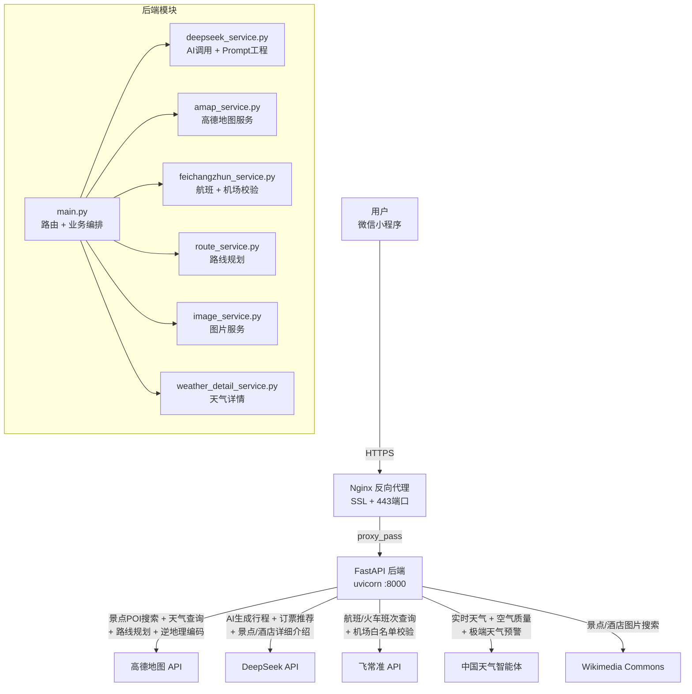

# 行旅白 - AI 旅行攻略生成器

> 输入目的地和天数，AI 自动生成完整旅行攻略——含每日景点、实时天气、交通规划、酒店推荐、门票预订建议。

🌐 **在线体验**：[lvbaixing.top](https://lvbaixing.top)

---

## ✨ 功能特性

- 🤖 **AI 智能行程规划** — DeepSeek 大模型生成多日详细行程
- 🗺️ **真实景点数据** — 高德地图 POI 搜索，按评分智能排序
- 🌤️ **实时天气预报** — 高德天气 + 中国天气智能体，含极端天气预警
- ✈️ **交通规划** — 飞常准航班查询 + 高德路线规划，支持自驾/高铁/飞机
- 🏨 **酒店门票推荐** — AI 推荐住宿和门票预订方案
- 📸 **真实图片** — 景点/酒店自动匹配真实图片
- 📱 **微信小程序** — 原生小程序前端，支持地图总览和行程分享
- 🔄 **智能重生成** — 不满意？输入新需求，AI 重新规划

---

## 🏗️ 架构图



### 核心流程


---

## 🛠️ 技术栈

| 层级 | 技术 | 用途 |
|------|------|------|
| 前端 | 微信小程序原生 | 用户界面、地图展示、行程分享 |
| 后端 | FastAPI + Uvicorn | 异步 API 服务 |
| 网络层 | httpx (async) | 异步 HTTP 客户端，多 API 并发调用 |
| 数据校验 | Pydantic | 请求体类型校验 |
| AI | DeepSeek API | 行程生成、订票推荐、景点介绍 |
| 地图 | 高德地图 API | POI 搜索、天气、路线规划、逆地理编码 |
| 航班 | 飞常准 API | 真实航班/火车班次查询 |
| 天气 | 中国天气智能体 | 实时天气、空气质量、预警 |
| 部署 | Nginx + systemd | HTTPS 反向代理 + 进程管理 |
| SSL | Let's Encrypt | 免费 HTTPS 证书 |

---

## 📁 项目结构

```
行旅白/
├── backend/                    # 后端服务
│   ├── main.py                 # FastAPI 主入口（路由 + 业务编排）
│   ├── deepseek_service.py     # DeepSeek AI 调用 + Prompt 工程
│   ├── amap_service.py         # 高德地图服务（POI/天气/地理编码）
│   ├── feichangzhun_service.py # 飞常准航班服务 + 机场白名单校验
│   ├── route_service.py        # 高德路线规划服务
│   ├── china_weather_service.py # 中国天气智能体服务
│   ├── weather_detail_service.py # 天气详情服务
│   ├── image_service.py        # 图片补全服务
│   ├── image_search_service.py # 图片搜索服务
│   ├── models.py               # Pydantic 数据模型
│   ├── config.py               # 配置管理（环境变量）
│   └── requirements.txt        # Python 依赖
├── miniprogram/                # 微信小程序前端
│   ├── pages/
│   │   ├── index/              # 首页（输入目的地）
│   │   ├── trip/               # 行程详情页
│   │   ├── overview/           # 行程总览（列表+地图）
│   │   └── map/                # 地图页
│   └── utils/                  # 工具函数
│       ├── api.js              # API 请求封装
│       ├── markers.js          # 地图标记
│       ├── progress.js         # 进度管理
│       └── share.js            # 分享功能
├── deploy/                     # 部署配置
│   ├── nginx.conf              # Nginx 配置（HTTPS）
│   ├── deploy.sh               # 一键部署脚本
│   ├── lvbai.service           # systemd 服务文件
│   └── .env.example            # 环境变量模板
├── deploy_script.py            # 自动部署脚本
└── update_nginx.py             # Nginx 配置更新脚本
```

---

## 🚀 快速开始

### 环境要求

- Python 3.10+
- 微信开发者工具（前端）

### 后端启动

```bash
# 1. 安装依赖
cd backend
pip install -r requirements.txt

# 2. 配置环境变量
cp ../deploy/.env.example .env
# 编辑 .env 填入你的 API Key
# DEEPSEEK_API_KEY=你的DeepSeek密钥
# AMAP_API_KEY=你的高德地图密钥

# 3. 启动服务
python main.py
# 或: uvicorn main:app --host 0.0.0.0 --port 8000 --reload
```

### 前端启动

```bash
# 1. 打开微信开发者工具
# 2. 导入 miniprogram/ 目录
# 3. 在 app.js 中修改后端地址为 http://localhost:8000
```

### 生产部署

```bash
# 一键部署（需 Ubuntu 服务器 + 域名）
cd deploy
chmod +x deploy.sh
sudo bash deploy.sh

# 配置 SSL 证书
certbot --nginx -d lvbaixing.top -d www.lvbaixing.top
```

---

## 🔧 核心技术亮点

### 1. Prompt 工程

行程生成 Prompt 包含：
- **JSON Schema 约束** — 强制 AI 输出结构化 JSON，前端直接解析
- **真实数据注入** — 高德 POI 评分数据 + 天气预报 + 航班班次全部注入 Prompt
- **节奏自适应** — 0-100 节奏滑块，AI 根据节奏调整每日景点数量
- **人数自适应** — 1人独行 vs 8人团建，AI 自动调整行程安排

### 2. 机场安全三层防护

```python
# 第一层：Prompt 中注入白名单（42个运营机场）和黑名单（9个停用机场）
# 第二层：后处理 _validate_transport_airports() 校验 AI 输出
# 第三层：黑名单精确匹配 + 白名单校验 + 自动修正/清空
```

防止 AI 编造已关闭机场（如北京南苑2019年关闭、昆明巫家坝2012年关闭）。

### 3. 异步并发优化

```python
# POI 搜索和天气查询并行执行
poi_results = await asyncio.gather(*poi_tasks)
weather_data = await weather_task

# 图片获取带超时保护，不阻塞主流程
await asyncio.wait_for(fill_images(trip_data, dest), timeout=25.0)
```

### 4. 错误处理分层

```python
except httpx.HTTPStatusError as e:
    if e.response.status_code == 402:
        err_msg = "DeepSeek API 余额不足，请充值后重试"
    elif e.response.status_code == 429:
        err_msg = "请求过于频繁，请稍后重试"
```

---

## 📸 截图

> TODO: 添加小程序截图

---

## 📝 开发历程

- 2026.07 初版上线 — 基础行程生成
- 2026.07 模块化重构 — 后端拆分为12个服务模块
- 2026.07 交通规划增强 — 飞常准航班 + 中转换乘 + 自驾路线
- 2026.07 安全加固 — 机场黑名单三层防护机制
- 2026.07 部署完善 — HTTPS + systemd + Nginx 反向代理

---

## 📄 License

MIT
